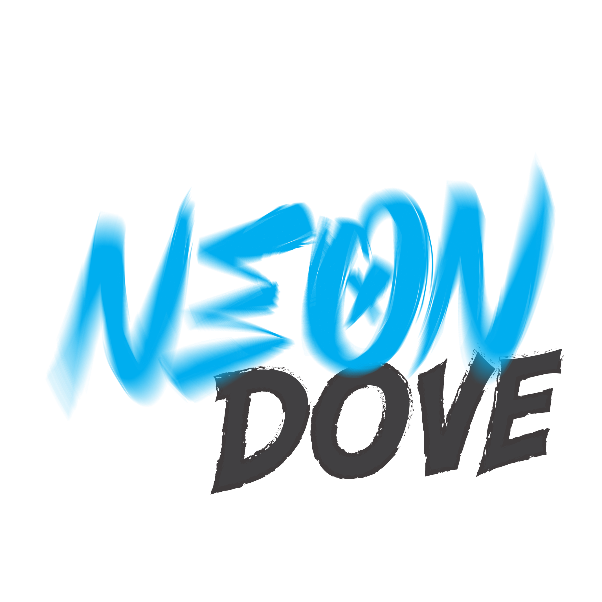
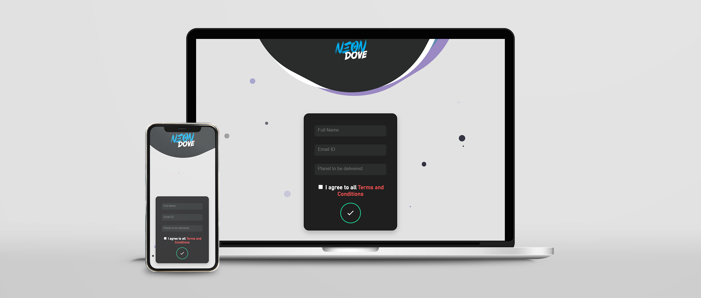
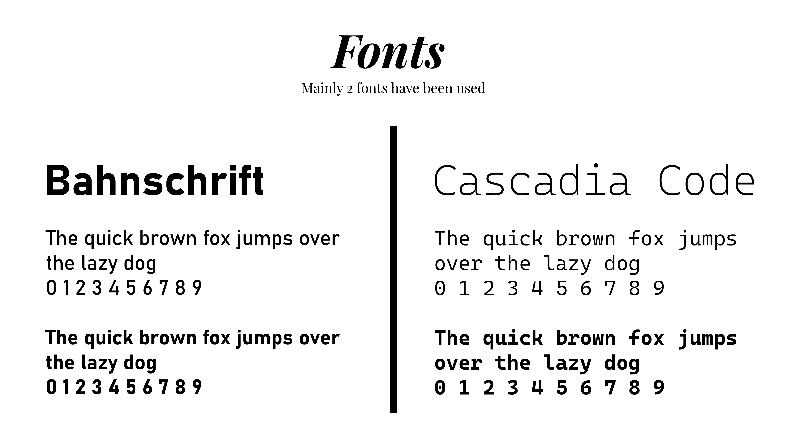
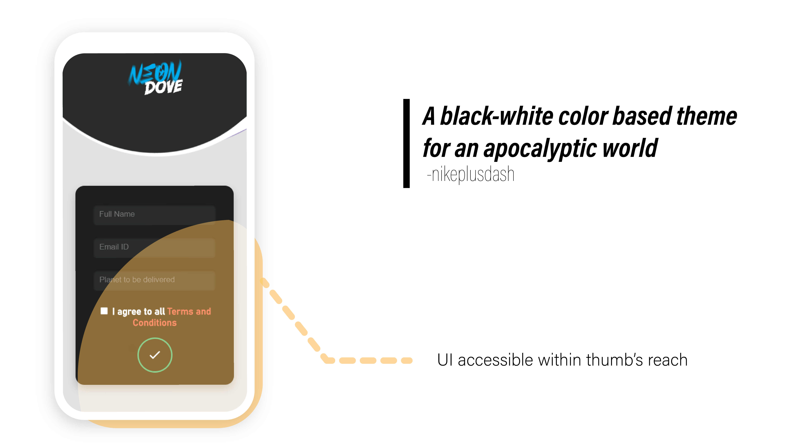
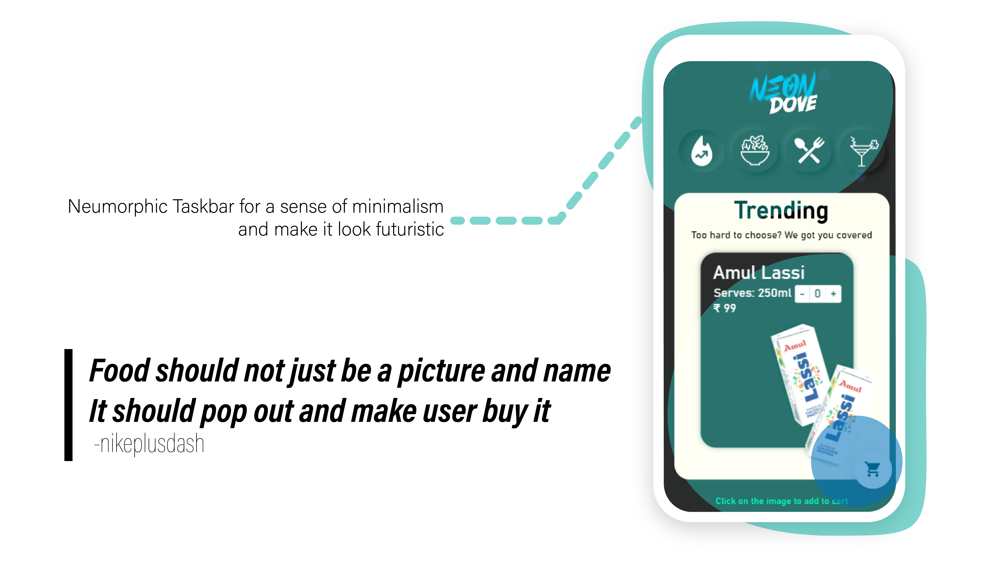
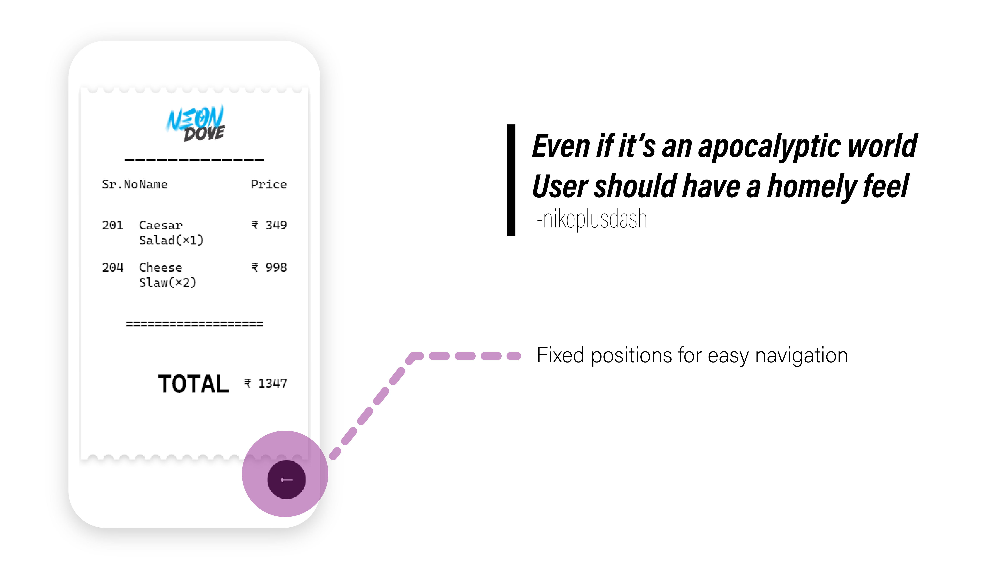

# Neon-Dove

After the humiliating defeat of humanity, we had now where to go. But now with the help of hyperspace travel, all humans have started to live normally again and have inhabited many different planets. This is where Neon Dove comes in for quick and convenient food delivery while not missing out on any country's cuisine.

---
## Navigation
 

This mainly consists of 3 pages:

* Landing Info Registration Page
* Menu Selection Page
* Receipt Generation

---
## Why the name Neon Dove?
 

> Because I used a generator and that's what it generated

Just kidding, it;s partially true but I went through a list of names and I felt the UI I had in mind, as well as the EXODUS theme, matches with the name 'Neon' and 'Dove' for the peace that will exist from now on.

---
## Some UI Details

---
## Check out the website

<h1><a href="https://nikeplusdash.github.io/neon-dove/" target="_blank">HERE</a></h1>
